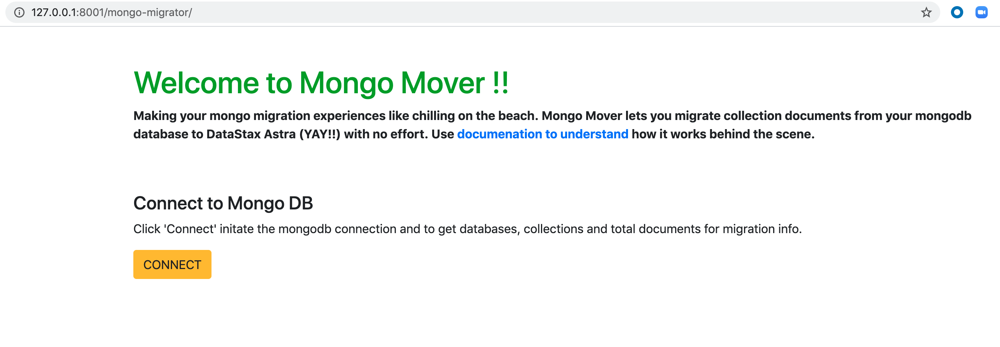
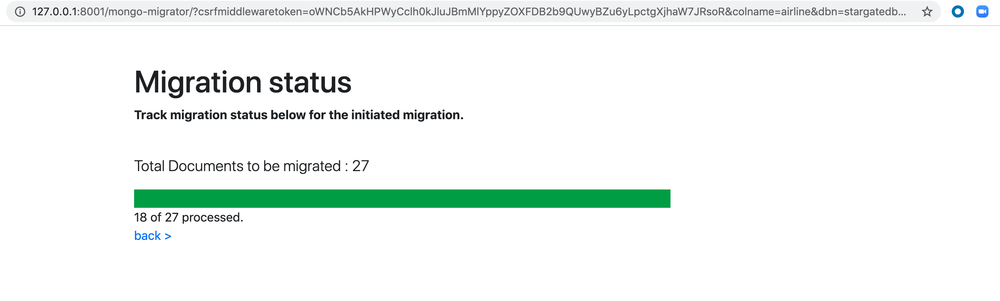

## Document Migrator Application for Astra

This application helps to migrate documents out of Document based databases to DataStax Astra. This example application uses mongoDB as source of documents that are migrated to Astra using this application.


## High Level Architecture 
Key components 
- Document Database : MongoDB
- Application : Django, celery, redis 
- Stargate document API
- DataStax Astra 


## Configuration 

All configurations to be setup within `config.ini`

```
[mongo]
host=34.227.105.4
port=27017

[astra]
clusterid=Astra Cluster ID
region=Astra Cluster Region
username=Astra Database Name
password=Astra Database Password
collection=Astra Table name 
namespace=Astra Keyspace Name
```

## Running the Migration App

Run the django app 

```python manage.py runserver```

Run CELERY BROKER - Needed for task progress bar

```celery -A stargate_mongo_migrator worker -l info```

Setup information for CELERY with Django 

## Application Flow
1. Home page to connect to mongodb databses


2. Click datbase to identify collections to migrate 


3. Click collection to migrate data


4. Migration Status page
