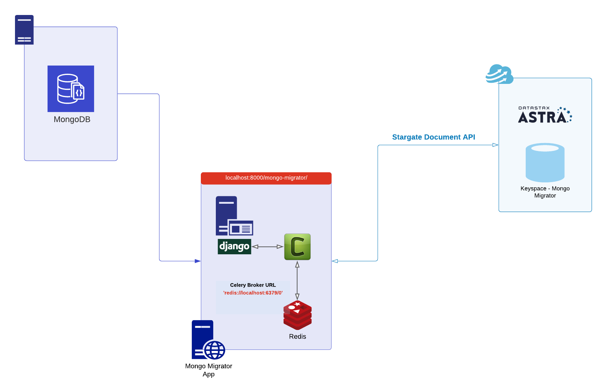
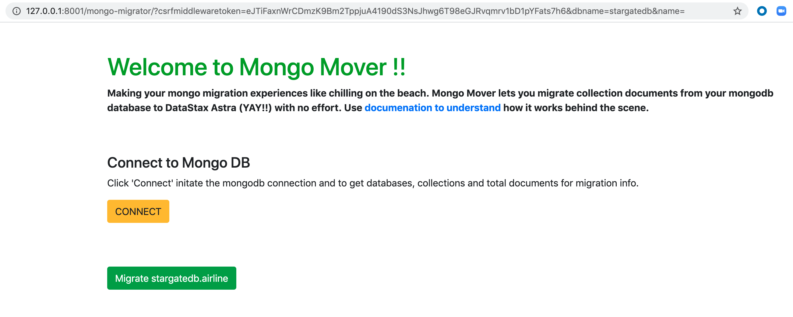
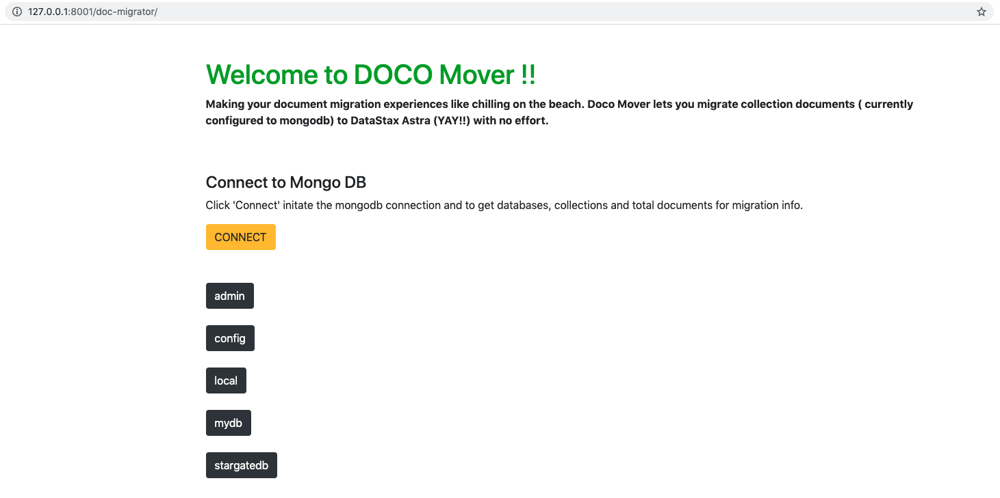
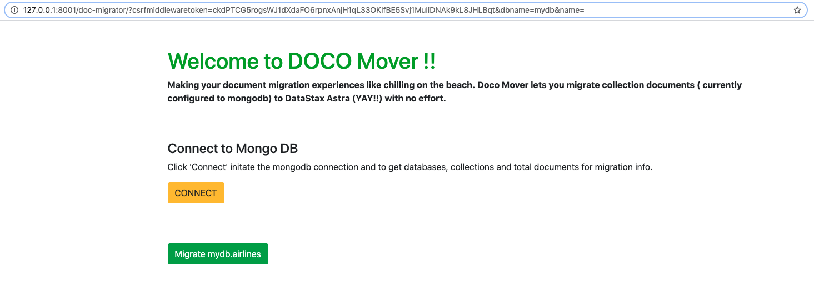
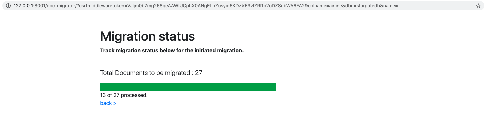

## Document Migrator Application for Astra

This application helps to migrate documents out of Document based databases to DataStax Astra. This example application uses mongoDB as source of documents that are migrated to Astra using this application.


## High Level Architecture for the Application

- Stargate document API
- DataStax Astra 
- Application : Django, celery, redis 
- Document Database : MongoDB




## Configuration 

All configurations to be setup within `config.ini`

```
[mongo]
host=34.227.105.4
port=27017

[astra]
clusterid=Astra Cluster ID
region=Astra Cluster Region
username=Astra Database Name
password=Astra Database Password
collection=Astra Table name 
namespace=Astra Keyspace Name
```

## Key Components 

#### 1. Stargate API 

The key to being able to migrate or add documents in Astra is the Amazing stargate API. Here is an example of building the stargate document API, something similar to what we have used in the written application. 

```
  CLUSTERID = conf['clusterid']
  REGION = conf['region']
  COLLECTION = conf['collection'] // similar to Table in Astra
  NAMESPACE = conf['namespace']   // similar to keyspace in Astra
  URL = f"https://{CLUSTERID}-{REGION}.apps.astra.datastax.com" 
  DOC_ROOT_PATH = f"/api/rest/v2/namespaces/{NAMESPACE}/collections/{COLLECTION}/{AIRLINE_ID}" 
  PUTTURL = URL+DOC_ROOT_PATH
  ```

Make sure you pass a unique document id per API request during document migration. Each document Id is refers to a single partition in Astra. 

Check `tasks.py` for more details.

#### 2. DataStax Astra

Get started with Astra at ```https://astra.datastax.com/``` and create a database.

https://docs.astra.datastax.com/docs/creating-your-astra-database

#### 3. Celery For Task Progress in Django 

Make sure to run both the Celery worker and Django app. Again, the celery broker is optional and is required only because of the progress bar feature in the app. You can use the same code and write it another way to capture document progress. 

Follow this link on how to setup Django and CELERY: 

https://docs.celeryproject.org/en/stable/django/first-steps-with-django.html

Follow this link to use redis as broker with CELERY:

https://docs.celeryproject.org/en/stable/getting-started/brokers/redis.html

## Running the Application 

Run CELERY BROKER - Needed for task progress bar

```celery -A stargate_mongo_migrator worker -l info```

Run the django app 

```python manage.py runserver```


## Application Flow 
1. Home page to connect to mongodb databses


2. Click database to identify collections to migrate 


3. Click collection to migrate data


4. Migration Status page


### Python Dependencies 
Check `requirements.txt` 

key libraries : `Django, django-celery-results, celery, celery-progress, pymongo.`
 
